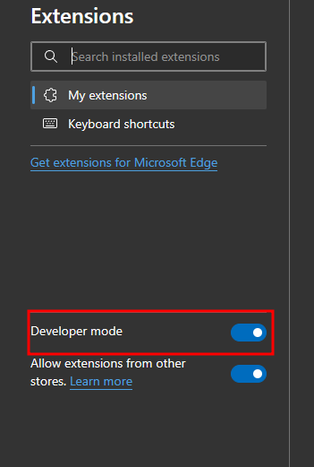
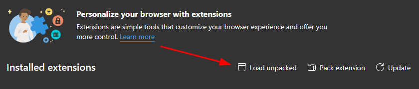

# LITMOS DOWNLOADER

Para hacer uso de esta herramienta se deben realizar los siguientes pasos.

1. Habilitar el modo desarrollador de chrome, edge, etc.

2. Hacemos click en cargar extension desempaquetada.

3. Seleccionamos el folder src, que esta dentro de este repositorio.

4. Una vez instalada la extension ejecutar, se debe tener una pestaña de litmos abierta y hacer click en el icono de la extension.
5. En la nueva pestaña se debe seleccionar los cursos a descargar y hacer click en descargar.
6. Seleccionamos la carpeta donde se debe guardar los videos.
7. Esperamos